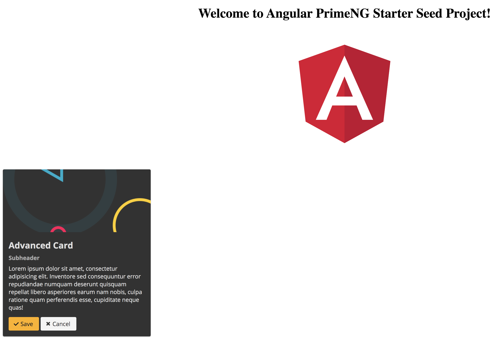

# Angular PrimeNG Starter Seed Project

This project was generated with [Angular CLI](https://github.com/angular/angular-cli) version 8.0.3.

## Setup
1. Fork/Clone this repository `git clone https://github.com/stayingcool/angular8-primeng-seed.git`
2. Move to directory in the terminal `cd angular8-primeng-seed`
2. Run `npm install`

## Run Development server

Run `ng serve` for a dev server. Navigate to `http://localhost:4200/`. The app will automatically reload if you change any of the source files.

## Code scaffolding

Run `ng generate component component-name` to generate a new component. You can also use `ng generate directive|pipe|service|class|guard|interface|enum|module`.

## Landing Page (Shows Angular Icon and PrimeNG Card)

## Build

Run `ng build` to build the project. The build artifacts will be stored in the `dist/` directory. Use the `--prod` flag for a production build.

## Running unit tests

Run `ng test` to execute the unit tests via [Karma](https://karma-runner.github.io).

## Running end-to-end tests

Run `ng e2e` to execute the end-to-end tests via [Protractor](http://www.protractortest.org/).

## Further help

To get more help on the Angular CLI use `ng help` or go check out the [Angular CLI README](https://github.com/angular/angular-cli/blob/master/README.md).
